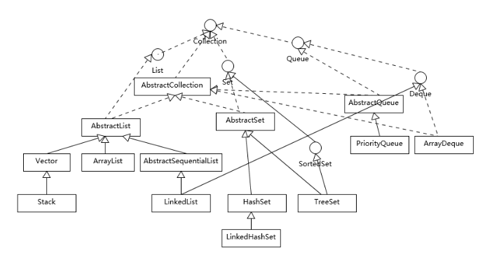

**Vector**

1. 线程安全的动态数组，不建议选择，同步有额外开销
2. 内部使用对象数组来保存数据，可以根据需要自动增加容量
3. 数组已满时，会创建新的数组，并拷贝原来的数组数据
4. 默认创建一个大小为10的Object数组，并将capacityIncrement设置为0；当插入元素数组大小不够时，如果capacityIncrement大于0，则将Object数组的大小扩充为现有size+capacityIncrement, 如果capacityIncrement<=0,则将Object数组的大小扩为现有大小的2倍。

**ArrayList**

1. 动态数组
2. 不是线程安全的
3. 可以根据需要增加容量
4. 扩容时会提高50%,扩容过程需要调用底层System.arraycopy()方法进行大量的数组复制操作，删除时不会减少数组容量，可以调用trimToSize()方法，查找元素时需要遍历数组，对于非null元素采用equals方式查找。
5. 插入删除速度慢，检索速度快

**LinkedList**

1. 双向链表
2. 不需要调整容量
3. 不是线程安全的
4. 插入元素时，需创建一个Entry对象，并更新该元素的前后元素的引用，查找元素时，需要遍历链表；删除元素，需要遍历链表，找到要删除的元素
5. 增加删除速度快，检索速度慢

### 三者适合场景

1. Vector和ArrayList适合随机访问，除了尾部插入和删除元素，其余操作性能相对较差
2. LinkedList进行节点插入、删除，所以性能高效，但是随机访问要比上面两个慢

### 需要掌握的排序算法

1. 内部排序：归并排序、交换排序(冒泡，快排)、选择排序、插入排序等。
2. 外部排序：掌握利用内存和外部存储处理超大数据集

1. List
2. Set: 不允许插入重复元素
    1. TreeSet 支持自然顺序访问，添加、删除、包含等操作相对低效
    2. HashSet 利用哈希算法 常数时间的添加、删除、包含等操作，但是不保证有序，初始化时，不要把容量设置过大
    3. LinkedHashSet 内部构建了一个记录插入顺序的双向链表，性能略低于HashSet。
3. Queue/Deque

### java默认提供的排序算法

1. 对于原始数据类型，目前使用的是双轴快速排序，是一种改进的快速排序算法，[源码地址](http://hg.openjdk.java.net/jdk/jdk/file/26ac622a4cab/src/java.base/share/classes/java/util/DualPivotQuicksort.java)
2. 对于对象数据类型，目前使用的是[TimSort](http://hg.openjdk.java.net/jdk/jdk/file/26ac622a4cab/src/java.base/share/classes/java/util/TimSort.java),思想上是一种归并和二分插入排序结合的优化排序算法，思路是查找数据集中已经排好序的分区，然后合并这些分区来达到排序的目的。

> Collections提供了一系列的synchronized方法
> 
> List list = Collections.synchronizedList(new ArrayList());

