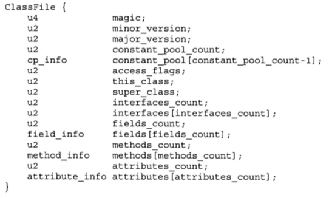
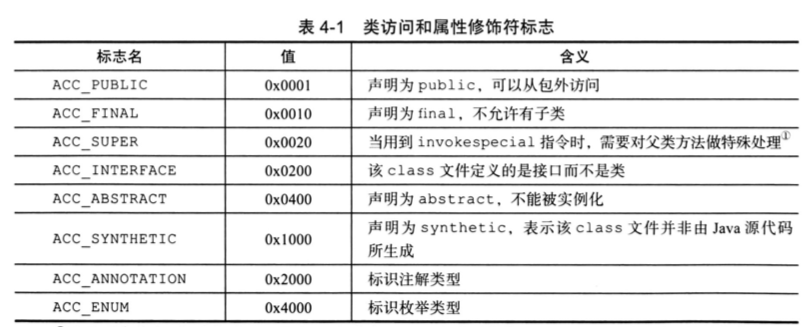

### 类文件结构

Class 文件格式采用一种类似于 C 语言结构体的伪结构来存储数据，这种伪结构有两种数据类型：无符号数和表。

1. 无符号数 属于基本的数据类型，以 u1，u2，u4，u8 来分别表示 1 个字节，2 个字节，4 个字节和 8 个字节的无符号数，可以用来描述数字，索引引用，数量值或者按照 UTF-8 编码构成的字符串值
2. 表 由多个无符号数或者其他表作为数据项构成的复合数据类型，所以表都习惯性的以"\_info"结尾。用于描述有层次关系的复合结构的数据，整个 class 文件本质上就是一张表。

1. magic 魔数 用来确定这个文件是否能被虚拟机所能接收的 class 文件，魔数固定为 0xCAFEBABE，不会改变。
2. minor_version(副版本号) major_version(主版本号)
3. constant_pool_count 常量池计数器 值等于常量池表中的成员数加 1
4. constant_pool[] 常量池，是一种表结构，包含 class 文件结构及其子结构中引用的所有字符串常量、类或者接口名、字段名和其他常量。
   > 1. 主要存放字面量和符号引用
   > 2. 符号引用包括下面三类常量:
   >    1. 类和接口的全限定名
   >    2. 字段的名称和描述符
   >    3. 方法的名称和描述符

> Class 文件中方法、字段都需要引用 CONSTANT_Utf8_info 型常量，所以 CONSTANT_Utf8_info 型常量的最大长度也就是 java 中方法和字段的最大长度。即 u2 类型的最大长度 65535.

5. access_flags 访问标志 是一种由标志组成的掩码，用于表示某各类或者接口的访问权限以及属性。

    1. 带有ACC_INTERFACE标志的class文件表示是接口而不是类，反之则表示是类而不是接口
    2. 如果一个类被这只了ACC_INTERFACE，那么同时也得设置ACC_ABSTRACT,同时不能再设置ACC_FINAL、ACC_SUPER或ACC_ENUM标志。
    3. 如果没有设置ACC_INTERFACE标志，这个class文件可以具有除ACC_ANNOTATION之外的其他所有标志，ACC_FINAL和ACC_ABSTRACT这类互斥的标志除外
    4. ACC_SYNTHETIC标志意味着该类或接口是由编译器生成的，而不是由源代码生成的。
    5. ACC_ENUM 标志表明该类或其父类为枚举类型。

6. this_class 值必须是对常量池表中某项的一个有效索引值，常量池在这个索引处的成员必须为 CONSTANT_CLASS_INFO 类型的结构体，该结构体表示这个 class 文件所定义的类或接口。
7. super_class 父类索引 ，对于类来说，super_class 的值要么是 0，要么是对常量池中某项的一个有效的索引值，如果不为 0，那么常量池在这个索引处的成员必须是 CONSTANT_CLASS_INFO 类型常量，他表示这个 class 文件所定义的类的直接超类，在当前的直接超类，以及他所有间接超类的 classfile 结构体中，access_flags 里面均不能带有 ACC_FINAL 标志。
8. interface_count 接口计数器，用来表示当前类或者接口的直接超接口数量。
9. interfaces[] 接口表
10. fields_count 字段计数器 表示 class 文件 fields 表的成员个数
11. fields[] 字段表 每个成员都必须是一个 fields_info 结构的数据项，用于表示当前类或接口中某个字段的完整描述，不包括从父类或父接口继承的那些字段。
12. methods_count 方法计数器 表示当前 class 文件 methods 的成员个数，每个成员都是一个 method_info 结构
13. methods[] 方法表 只包含当前类或接口中的方法，不包括从父类或父接口继承的方法。
14. attributes_count 属性计数器 表示当前 class 文件属性表的成员个数，
15. attributes[] 属性表 每个项的值都是 attribute_info 结构。
